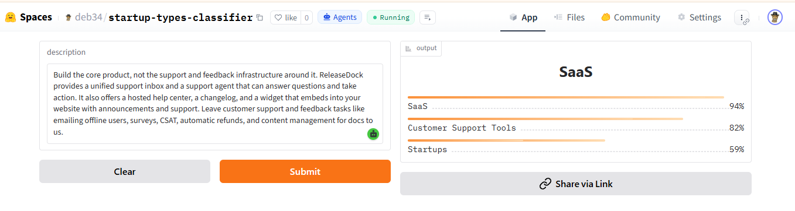

## 📌 Overview

This project presents one of the first known attempts to build a multi-label startup industry classifier using real-world scraped data at scale. While text classification datasets are common, no publicly available dataset or model exists that specifically targets startup product categorisation across diverse industry genres — making this work novel in both dataset construction and task framing.

The pipeline was built entirely from scratch. Over 21,000 startup entries were collected by scraping [BetaList](https://betalist.com) — a live platform listing newly launched tech products — across dozens of categories including AI, SaaS, FinTech, developer tools, and more. Each entry captures the startup's name, tagline, full product description, genre labels, and source URL. The data collection alone required building a multi-stage Selenium scraper capable of handling pagination, dynamic content, crash recovery, and chunked batch processing across thousands of individual product pages.

The resulting dataset of 21,408 startups with zero null values was then used to fine-tune transformer-based language models for multi-label classification — predicting which industry categories a startup belongs to purely from its text. This kind of large-scale, domain-specific, multi-label NLP dataset for the startup ecosystem does not exist elsewhere in the open literature, making it a meaningful contribution beyond the modelling work itself.

## 📊 Dataset Sample

| name | motto | description | topics | url |
|------|-------|-------------|--------|-----|
| OutboundGateway | Route traffic securely... | Provides HTTPS... | Internet Service Providers, Security | betalist.com/... |
| Flux Plugins | Speed up WordPress... | AI-powered image, SEO... | Blogging, Optimization | betalist.com/... |

**Shape:** `(21408, 5)` · **Nulls:** `0`

---

## 🧠 Models

| Model | Type | Notes |
|-------|------|-------|
| DistilBERT | Encoder | Fast baseline |
| RoBERTa-base | Encoder | Best performance |
| MiniLM-L12 | Encoder | Efficient deployment |

## 📈 Model Comparison & Results

All models trained on same dataset. RoBERTa-base wins across all metrics.

### Training Results

**RoBERTa-base** ✅ *Selected for inference*

| Epoch | Train Loss | Valid Loss | Accuracy | Precision | Recall | F1 |
|-------|-----------|-----------|----------|-----------|--------|----|
| 0 | 0.0654 | 0.0712 | 0.9703 | 0.369 | 0.263 | 0.266 |
| 3 | 0.0555 | 0.0643 | 0.9753 | 0.487 | 0.365 | 0.369 |
| 6 | 0.0419 | 0.0561 | 0.9813 | 0.595 | 0.448 | 0.463 |
| **9** | **0.0380** | **0.0545** | **0.9828** | **0.591** | **0.468** | **0.484** |

**Micro F1 (final): `0.7683`** 🏆

---

**MiniLM-L12**

| Epoch | Train Loss | Valid Loss | Accuracy | F1 |
|-------|-----------|-----------|----------|----|
| 2 | 0.1140 | 0.1118 | 0.9513 | 0.023 |

**Micro F1: ~0.023** ❌ Failed to converge

---

**DistilBERT**

| Epoch | Train Loss | Valid Loss | Accuracy | F1 |
|-------|-----------|-----------|----------|----|
| 0 | 0.1004 | 0.0977 | 0.9569 | 0.078 |
| 4 | 0.1143 | 0.1118 | 0.9513 | 0.023 |

**Micro F1: ~0.023** ❌ Collapsed after epoch 0

---

### Why RoBERTa-base?

| Metric | RoBERTa-base | MiniLM-L12 | DistilBERT |
|--------|-------------|-----------|-----------|
| Micro F1 | **0.7683** | ~0.023 | ~0.023 |
| Final Accuracy | **98.28%** | 95.13% | 95.13% |
| Convergence | ✅ Steady | ❌ Flat | ❌ Collapsed |
| Epochs trained | 10 | 3 | 5 |

RoBERTa-base steadily improved every epoch — F1 grew from `0.266 → 0.484` (macro) and reached **`0.7683` micro F1**. MiniLM and DistilBERT both collapsed to near-zero F1 after epoch 0, indicating failure to learn label structure.

> **RoBERTa-base selected → converted to ONNX for fast, portable inference.** See `onnx_conversion/`.

---
## 🌐 Live Demo

The trained RoBERTa-base model is deployed as an interactive web app on Hugging Face Spaces using Gradio. Paste any startup description and the model returns predicted industry genres with confidence scores in real time.

🔗 **[Try it live → deb34/startup-types-classifier](https://huggingface.co/spaces/deb34/startup-types-classifier)**

> *Example: A customer support SaaS startup description correctly predicted as **SaaS (94%)**, **Customer Support Tools (82%)**, and **Startups (59%)**.*

## 📄 License

MIT — see [LICENSE](LICENSE)

---

Built by <a href="https://github.com/Deb-hridoy">Deb Hridoy</a> · BetaList × HuggingFace × Selenium
